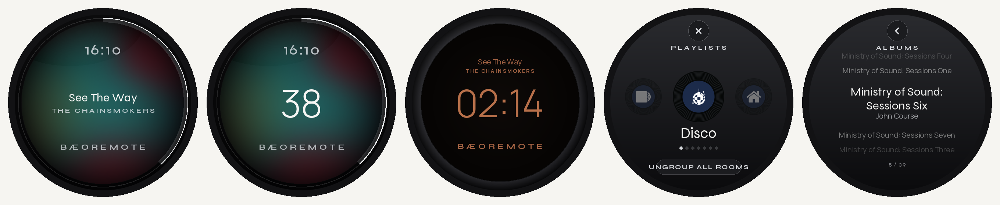

# BæoRemote

A B&O Essence–inspired Sonos controller for a 480×480 round ESP32-S3 knob display
(ST7701S RGB panel, CST816 touch, rotary encoder), running ESPHome 2026.9 + LVGL 9.



<sub>Rendered from the firmware's own layout values, fonts and colours (`docs/render_screens.py`), not screen captures; the album art is a stand-in.</sub>

## Screens
- **Now playing (Nocturne)**: smoked glass over a soft blur of the current album art, with the clock above, title and artist in the middle, and a thin volume ring round the edge. When Club is on the TV input it shows the Plex / Google TV title and poster, or "ABC" for iview.
- **Volume**: turning the knob swaps the title for a large volume numeral and lights the ring.
- **Night**: after 3 minutes idle, a dim amber Manrope clock on near-black, with the backlight at *Night Brightness* ([spec](docs/BaeoRemote%20Face%20A%20Spec.pdf)).
- **Playlists**: hold the knob to open. Curated mixes, then **Favourites** (all Sonos favourites) and **Albums** (Music Assistant favourites) as scroll wheels.

## Controls
| Input | Action |
|---|---|
| Turn | Volume (hold + turn = scrub) |
| Press / double / triple | Play-pause / next / previous |
| Hold | Playlists: Disco, House, MOS, PDM, DFP, **Favourites**, **Albums**, Ungroup all rooms |
| Swipe (on Playlists) | Back |

The work-alarm popup comes from the base config and is unchanged.

## Layout
- `rotary-display-1.yaml`: the original device config. It provides the display/SPI setup, alarm popup, numbers and base settings.
- `tt/body.yaml`, `tt/tail.yaml`: the BæoRemote scripts, fonts, sensors and LVGL pages.
- `tt/assemble.py`: splices the two together into `rotary-display-1.new.yaml`, which is generated and git-ignored.
- `ha/rotary_lists.yaml`: the Home Assistant package behind the Favourites / Albums lists (`sensor.rotary_lists` + `script.rotary_play_list`). Add it under `homeassistant: packages:`.
- `docs/`: night-face spec, screen renders and the script that makes them.

## Build
```bash
cp secrets.example.yaml secrets.yaml   # fill in
python tt/assemble.py
esphome compile rotary-display-1.new.yaml
esphome upload rotary-display-1.new.yaml --device <ip>
```
Deploying to Home Assistant's ESPHome add-on means copying `rotary-display-1.new.yaml` to `/config/esphome/rotary-display-1.yaml`. The add-on's `secrets.yaml` needs the same keys.
